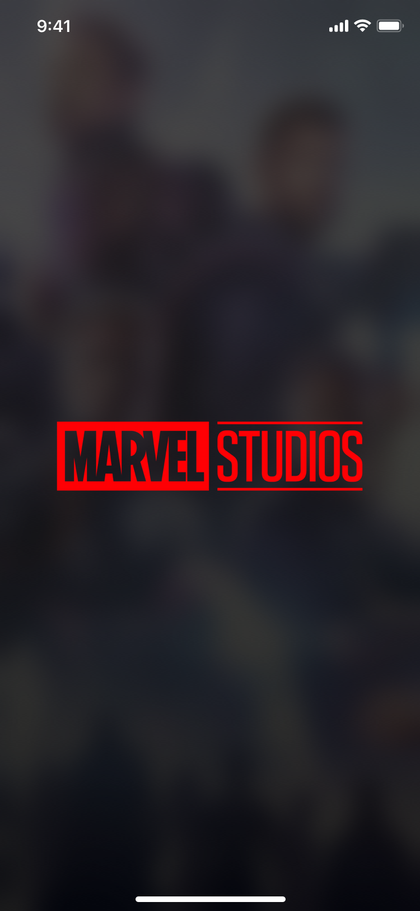
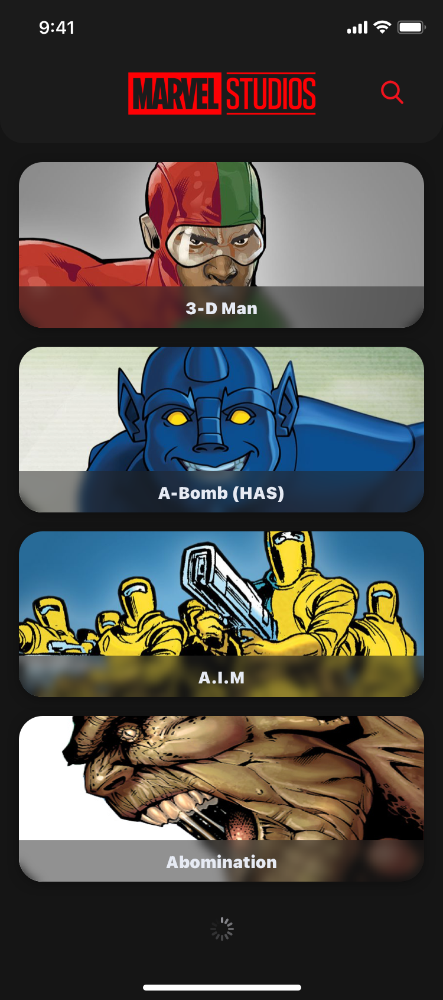
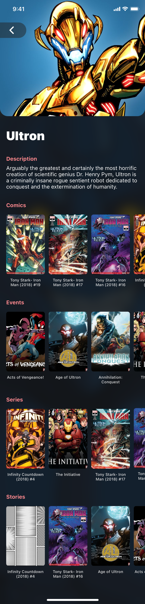
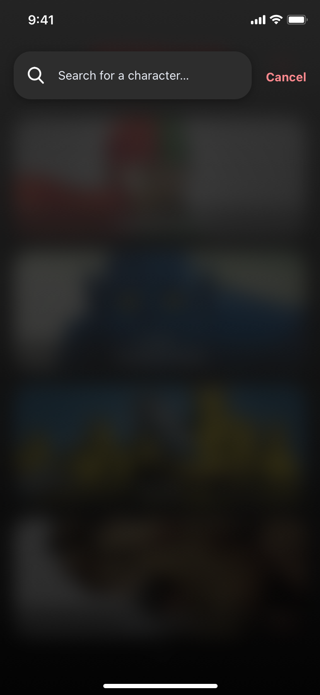
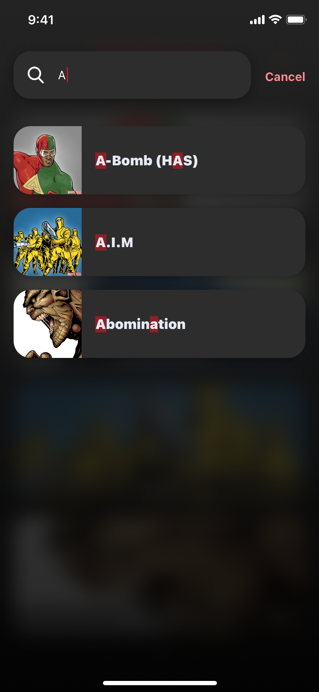

# MarvelApp
  Implement an app displaying the list of marvel characters. With the functionality to tap on a character and get a list of all the comics, events, series and stories he/she/it was in. Also the user can search for their favorite characters with a simple search function.

# Why you will continuously using this app 
 - The user can search for their favorite MARVEL character with a simple search function.
 - Know about MARVEL characters that you never know him.
 - It is a user friendly (UI/UX).

# Build status
 - Kotlin Language. 
 - MVVM Design Pattern.

# Code style
 - Kotlin Language. 
 - MVVM Design Pattern.

# Screenshots
- Logo 
 

- ScreenShot

    

# Tech/framework used

Built with (Native Android over android studion using KOTLIN language)

# Features
- User Friendly.
- Very fast.
- Helpful for parents to know alot about MARVEL characters thats seems to be adorable to the most of kids without searching over the internet.
- All information that you read about the characters will be from marvel official database that may let you feel safe about what you read.

# Code Example

 SearchFiledET.addTextChangedListener {
            filteredList.clear()
            for (i in 0 until list!!.size) {
                if (list!![i].name.contains(it.toString()) && it.toString() != "") {
                    filteredList.add(list!![i])
                }
            }
            if (it.toString() == "") {
                filteredList.clear()
            }
            val writtenCharacters = it.toString()
            //this is where you initialize your Adapter
            getSearchResult(filteredList as ArrayList<CharacterResult>, writtenCharacters)
        }
        
Installation

Provide step by step series of examples and explanations about how to get a development env running.

# API Reference

Welcome to the world's greatest comics API!
The Marvel Comics API is a tool to help developers everywhere create amazing, uncanny and incredible web sites and applications using data from the 70-plus years of the Marvel age of comics.
Ready to get started? Great!

#Here's the short version of what you need to do:
 - Sign up: Get an API key
 - Be a good API citizen: read, understand, and abide by the terms of use for the Marvel Comics API
 - Link back: observe the attribution and linking guidelines when displaying data from the API
 - Keep in touch: tell us about what you're building and talk to other developers on our community page
 - Build cool stuff

Finally, remember that the Marvel API suite and portal are in beta and this is an evolving project. To the extent that it is possible, we will try to communicate changes to the API before they occur and will try to limit any modifications which cause backwards incompatible changes to applications.
Tests

# Get Started

Marvel-Mobile app is built on Android. If you are new in Android, please head over to this great Video https://www.youtube.com/watch?v=uRyvNKRkwbs.

# License & copyright

Licensed under the [MIT License].(LICENSE)
